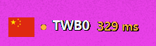

# Clash Verge Toolbar Widget

一款轻量的 Windows 任务栏节点状态组件，适用于 **Clash Verge Rev / Mihomo**。它可以实时显示当前节点地区、节点简称和延迟，并提供位置微调、双语界面及可靠的开机启动功能。

*A lightweight Windows taskbar status widget for **Clash Verge Rev / Mihomo**, showing the current node region, compact name, and latency in real time, with position controls, a bilingual interface, and reliable startup.*



It sits in the unused area on the far left of a centered Windows 11 taskbar, reads Mihomo state through the local named pipe, and displays:

- the current exit region flag;
- a compact node name such as `HK05` or `SGB03`;
- the latest latency, color-coded by connection quality.

The widget does not open a network port, upload telemetry, read subscription URLs, or modify Clash configuration.

## Current behavior

- Watches the `🚀 节点选择` policy group and recursively resolves nested groups to the actual outbound node.
- Refreshes latency every 5 seconds.
- Green: below 180 ms.
- Orange: 180–349 ms.
- Red: 350 ms or above, or unavailable.
- Gray: no recent result.
- Starts through an 8-second delayed logon task for reliable Windows startup, stays hidden while `clash-verge.exe` is not running, and appears automatically with Clash.
- Detects LiteMonitor and places itself to its right.
- Reasserts its taskbar overlay layer after maximized/full-screen window changes without taking keyboard focus.
- Includes a spacious, DPI-aware settings window with live horizontal/vertical position preview, refresh interval, startup, reset, and Chinese/English language selection.
- Recognizes flags for more than 30 common VPN locations across Asia, Europe, the Americas, and Oceania.

## Download

The current executable is available at [`dist/ClashLeftWidget.exe`](dist/ClashLeftWidget.exe).

Windows may show a SmartScreen warning because the executable is not code-signed. Review the source and build it locally if preferred.

## Build

Requirements:

- Windows 10/11
- .NET Framework 4.x compiler included with Windows
- PowerShell

Run:

```powershell
.\build.ps1
```

The executable is written to `dist/ClashLeftWidget.exe`.

## Configuration

Right-click the widget and select **设置… / Settings…**. Drag either position slider to preview movement immediately. Cancel restores the position from before the dialog was opened; Save keeps it. The current automatic position (to the right of LiteMonitor when detected) is offset `0` on both axes and remains the default. The interface can be switched between Chinese and English. Settings are saved per Windows user.

The Mihomo pipe name (`verge-mihomo`), root policy group (`🚀 节点选择`), and latency thresholds remain source-level settings for now.

## Controls

- Hover: show the full node name and policy chain.
- Left click: refresh immediately.
- Right click: show an auto-dismissing status menu, refresh, open settings, toggle startup, or exit.

## Limitations

Windows does not provide a public API for third-party widgets to embed natively in the left-side empty taskbar area. This project uses a borderless transparent tool window aligned over that area. It restores its topmost layer after window-mode changes, though exclusive full-screen games, taskbar auto-hide, nonstandard taskbar replacements, and some multi-monitor layouts may still require special handling.

The current process-following mode starts the small watcher at Windows logon, hides it while Clash is closed, and shows it when `clash-verge.exe` appears.

## Flag assets

Flag images are derived from MIT-licensed [country-flag-icons](https://github.com/csmoore/country-flag-icons) and its upstream flag icon set. See [`third_party/country-flag-icons-NOTICE.txt`](third_party/country-flag-icons-NOTICE.txt) and [`third_party/flag-icons-LICENSE.txt`](third_party/flag-icons-LICENSE.txt).

## Privacy

The widget only sends read-only HTTP requests over Mihomo's local Windows named pipe. It never prints or stores proxy passwords, subscription links, or controller secrets.

## License

Project code is released under the [MIT License](LICENSE).
